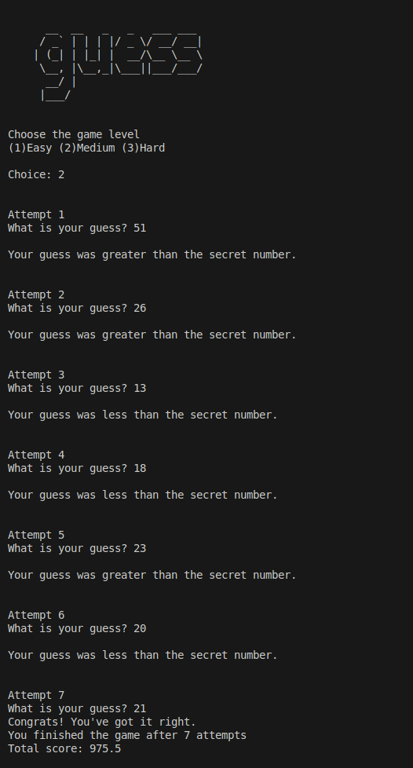

# Guessing Game in C

## Overview

This project is a simple number guessing game written in C. The game generates a random secret number between 0 and 99 and challenges the player to guess it. The game features different difficulty levels, which determine the number of attempts the player gets.

## Features

- Randomly generated secret number.
- Three difficulty levels:
  - Easy (20 attempts)
  - Medium (15 attempts)
  - Hard (6 attempts)
- Scoring system based on the number of attempts and the proximity of guesses to the secret number.
- Feedback on whether the guess was too high or too low.

## How to Play

1. Run the executable generated from the source code.
2. Choose a difficulty level by entering `1`, `2`, or `3`.
3. Enter your guesses when prompted. 
   - You will be informed if your guess is too high or too low.
   - Negative numbers are not accepted as valid guesses.
4. Continue guessing until you either guess the correct number or run out of attempts.
5. Your final score will be displayed at the end of the game.

## Example Run 


## Compilation and Execution

### Prerequisites
- C compiler (e.g., `gcc`)

### Compilation
To compile the program, use the following command in your terminal:

```bash
gcc -o guessing_game guessing_game.c
